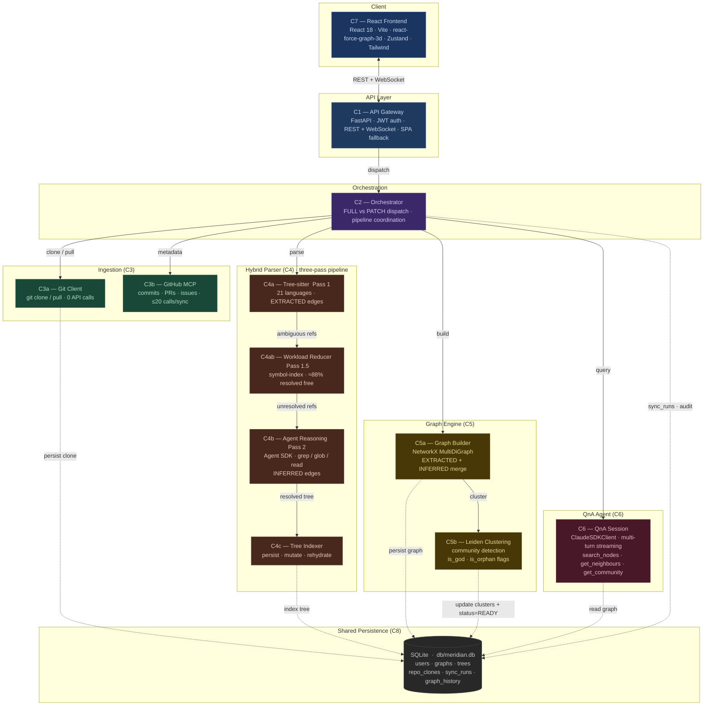

# Meridian

> A remote-first, agent-powered code knowledge graph builder.

Point Meridian at any GitHub repository and get back an interactive, queryable knowledge graph. Built with the Claude Code Agent SDK, tree-sitter, NetworkX, and Leiden clustering.

> **Working today, hardening for production.** There's no hosted demo to sign up for — Meridian is **self-hosted and bring-your-own-key (BYOK)**. Run it locally with Docker, supply your own Anthropic API key, and point it at any GitHub repo. See [Deployment](#deployment) to get started.

---

## Tech Stack

**Backend**  


**Frontend**  


---

## Features

- **Zero install for end users** — once an instance is running, users just provide a GitHub URL (and a PAT for private repos). You host the instance yourself (Docker + your own Anthropic key).
- **Three-pass parsing** — tree-sitter (Pass 1) for deterministic AST extraction across 21 languages, a symbol-index workload reducer (Pass 1.5) that resolves the easy cross-file refs without an LLM call, and agent reasoning (Pass 2) for surgical resolution of what's left.
- **Differential updates** — incremental graph patches in seconds via a built-in diff engine; no full rebuilds.
- **Graph-grounded QnA** — multi-turn streaming chat with answers that cite specific nodes and files, not hallucinated references.
- **Interactive visualization** — 3D WebGL-rendered force graph with semantic zoom, community coloring, and confidence-weighted edges.
- **Rate-limit-safe ingestion** — bulk file fetching uses `git clone` via subprocess (git protocol, zero API calls); GitHub MCP is used only for metadata enrichment.

---

## Architecture

Meridian is structured as **eight top-level components** (C1–C8) with sub-units lettered (e.g. C3a, C4b). C8 is shared persistence — every other component reads or writes through it.



_Solid arrows = synchronous call / data flow. Dashed arrows = persistence reads/writes through the shared C8 layer._

### Layer 1 — Ingestion

| Component | Technology | Role |
| ----------- | ---------- | ------ |
| C1: API Gateway | FastAPI | REST endpoints, WebSocket QnA, serves React SPA |
| C3a: Git Client | git CLI (subprocess) | Initial clone + pull via git protocol — zero API rate limit impact. Writes ephemeral clones to `ingestion_layer/repo_cache/codebase/<repo>/` (override via `CACHE_ROOT`) |
| C3b: GitHub MCP | GitHub MCP Server | Metadata only: commits between SHAs, PRs, issues |

**Hybrid ingestion model (rate-limit protection):**

| Operation | Method | API calls |
| ----------- | -------- | ----------- |
| Initial build | `git clone` via subprocess | 0 |
| Incremental update | `git pull` via subprocess + MCP diff | 2–5 |
| Metadata enrichment | GitHub MCP (PRs, issues, contributors) | 5–20 |
| **Total per sync** | | **~10–25** (vs 500–2000+ with MCP-only) |

### Layer 2 — Processing

| Component | Technology | Role |
| ----------- | ---------- | ------ |
| C2: Orchestrator | Plain async Python + Agent SDK (inside C4b) | Coordinates pipeline; makes FULL vs PATCH decisions |
| C4a: Tree-sitter (Pass 1) | `tree-sitter-language-pack` | Deterministic AST extraction across 21 languages → `EXTRACTED` edges |
| C4ab: Workload Reducer (Pass 1.5) | Symbol-index reducer (no LLM) | Resolves easy cross-file refs via project-wide symbol index → `EXTRACTED` edges |
| C4b: Agent Reasoning (Pass 2) | Agent SDK tools | Resolves ambiguous edges with grep/glob/read → `INFERRED` edges |
| C4c: Tree Indexer | SQLAlchemy + SQLite | Persists the C4a+C4ab+C4b parse tree to `trees`; mutated in place during PATCH |

**Pass 1** extracts modules, classes, functions, methods, and all deterministic edges (imports, same-file calls, contains, inherits, decorates) from raw ASTs. Cross-file / dynamic refs are flagged as `AmbiguousRef`.

**Pass 1.5** routes each `AmbiguousRef` through a language-specific reducer that builds a project-wide symbol index. Typical mixed-repo split: ~88% dropped (external/stdlib, no project match), ~10% resolved (unique cross-file matches), ~2% passed through to Pass 2.

**Pass 2** fires only when refs survive Pass 1.5. It uses `glob` to find candidate files, `grep` to locate definitions, and `read` to load specific line ranges — loading 2–3 files per resolution rather than the full repo.

### Layer 3 — Graph

| Component | Technology | Role |
| ----------- | ---------- | ------ |
| C5a: Graph Builder | NetworkX (`MultiDiGraph`) | Merges `EXTRACTED` + `INFERRED` edges; synthesises external nodes for cross-repo endpoints |
| C5b: Leiden Clustering | graspologic | Community detection on graph topology; no embeddings. Flags `is_god` (cross-community hubs) and `is_orphan` (isolates) |
| C8: Graph Store | SQLite (`db/meridian.db`) | Six tables: `users`, `graphs`, `trees`, `repo_clones`, `sync_runs`, `graph_history` |

**Node schema:**
```json
{
  "id": "src/auth/tokens.py::validate_token",
  "type": "function",
  "name": "validate_token",
  "file": "src/auth/tokens.py",
  "line_start": 42,
  "line_end": 67,
  "language": "python",
  "community": 3,
  "is_god": false,
  "is_orphan": false
}
```

**Edge schema:**
```json
{
  "source": "src/routes/api.py::login",
  "target": "src/auth/tokens.py::validate_token",
  "type": "CALLS",
  "confidence": "EXTRACTED",
  "weight": 1.0,
  "metadata": {}
}
```

Edge types: `IMPORTS`, `CALLS`, `CONTAINS`, `INHERITS`, `DECORATES`, `RELATES_TO`, `DEPENDS_ON`  
Confidence levels: `EXTRACTED` (tree-sitter, high trust) · `INFERRED` (agent, medium trust)

### Layer 4 — Output

| Component | Technology | Role |
| ----------- | ---------- | ------ |
| C6: QnA Agent | ClaudeSDKClient (multi-turn streaming) | Multi-turn WebSocket chat grounded in graph context |
| C7: React Frontend | React 18 + Vite + `react-force-graph-3d` (3D WebGL) + Zustand + Tailwind | Interactive 3D graph visualization with semantic zoom |

**QnA flow:** Per turn, server-side retrieval composes three tools — `search_nodes` (keyword-score top-K seeds), `get_neighbours` (full inbound/outbound edges per seed), `get_community` (Leiden cluster members) — formats them as readable text, and injects as `<graph_context>` into a streaming `ClaudeSDKClient` session. Session is reused across turns over a single WebSocket so prior history stays in the model's context.

**Frontend:** 3D force-directed WebGL layout (`react-force-graph-3d`, handles 5k+ nodes), Leiden community coloring, confidence-weighted edge thickness, partial semantic zoom, node sidebar with file link, multi-turn QnA playground (`PlaygroundChat`) over `WS /playground/{graph_id}`.

---

## API Reference

All `/repos` and `/graph` endpoints require `Authorization: Bearer <token>`. The PAT is passed per-request via the `X-GitHub-PAT` header on `/repos/sync` and is never stored.

| Method | Path | Description |
| -------- | ------ | ------------- |
| `POST` | `/auth/register` | Create a user account |
| `POST` | `/auth/login` | Authenticate; returns 24h JWT |
| `POST` | `/repos/sync` | Returns **202** immediately with `graph_id`; FULL or PATCH pipeline runs in background. Poll `GET /graph?graph_id=…` for `status` |
| `GET` | `/repos` | List authenticated user's graphs (metadata only) |
| `GET` | `/graph?graph_id=...` | Fetch the full knowledge graph JSON (nodes + edges) |
| `DELETE` | `/repos/{graph_id}` | Permanently delete a graph (cascades tree, history, clone) |
| `WS` | `/playground/{graph_id}?token=<JWT>&query=<initial>&agentic=<bool>` | Multi-turn streaming QnA |
| `WS` | `/repos/{graph_id}/status` | Stream build progress (TODO — not yet wired) |

---

## Database Schema

Six tables — `users`, `graphs`, `trees`, `repo_clones`, `sync_runs`, `graph_history`. SQLAlchemy entities live in `db/entities/`; engine + session lifecycle in `db/database.py` (PRAGMA `foreign_keys=ON` on every connection).

| Table | Purpose | Key columns |
| ------- | --------- | ------------- |
| `users` | Account records | `user_id` (PK), `email` UNIQUE, bcrypt `password`, `role` |
| `graphs` | Live graph payload (mutated in place across syncs) | `graph_id` (PK), `user_id` FK, `repo_clone_id` FK, `repo_url`, `branch`, `graph_data` JSON, `status` (`BUILDING`/`READY`/`ERROR`), counts. UNIQUE `(user_id, repo_url, branch)` |
| `trees` | Durable parse tree from C4 (mutated in place during PATCH) | `tree_id` (PK), `graph_id` FK UNIQUE, `tree_data` JSON, `last_commit_sha`, `status` |
| `repo_clones` | Clone tombstones — keep `last_commit_sha` after eviction so re-clone can resume | `repo_id` (PK, hash of repo_url), `user_id` FK, `path`, `evicted_at`. UNIQUE `(user_id, owner, repo, branch)` |
| `sync_runs` | Per-build audit row | `run_id` (PK), `graph_id` FK, `mode` (`FULL`/`PATCH`), `status`, delta counts, timestamps |
| `graph_history` | Immutable per-version snapshots of `graph_data` | `history_id` (PK), `graph_id` FK, `version` (monotonic), `run_id` FK, `graph_data` snapshot. UNIQUE `(graph_id, version)` |

`DELETE /repos/{graph_id}` cascades the tree, history, and clone record (and rmtrees the cache directory) but intentionally leaves `sync_runs` rows orphaned as a historical audit trail.

---

## Storage Model

| Storage | Location | Lifecycle | Loss impact |
| --------- | ---------- | ----------- | ------------- |
| Repo cache (ephemeral) | `ingestion_layer/repo_cache/codebase/<repo>/` (override via `CACHE_ROOT`) | TTL + LRU disk-budget eviction (TODO) | Zero — re-clone on next sync |
| SQLite DB (durable) | `db/meridian.db` | Persists until explicit `DELETE /repos/{graph_id}` | Catastrophic — back this up |

---

## Deployment

Single Docker image. FastAPI serves both the API and the built React SPA from `api/static/`. SQLite is embedded (no separate DB server).

**Run it yourself (self-hosted, BYOK).** There is no hosted Meridian to try — you run your own instance and bring your own Anthropic API key:

```bash
cp .env.example .env          # add your ANTHROPIC_API_KEY and ANTHROPIC_MODEL (set JWT_SECRET for prod)
docker compose up --build -d  # Meridian is now at http://localhost:8000
```

Token cost for Pass 2 (agent reasoning) and QnA is billed to your own Anthropic key.

**Container contents:** FastAPI + uvicorn (C1, serves static SPA), git CLI (C3a), `tree-sitter-language-pack` (C4a), Agent SDK runtime (C4b), NetworkX + graspologic (C5), SQLite (C8).

**External network dependencies:**
- GitHub (git protocol) — clone + pull, not rate limited
- GitHub REST API via MCP — metadata enrichment only, ≤20 calls per sync
- Anthropic API (or AWS Bedrock when `CLAUDE_CODE_USE_BEDROCK=1`) — Agent SDK (Pass 2) + ClaudeSDKClient (QnA)

---

## Cost Model

| Component | Cost |
| ----------- | ------ |
| git clone / pull | Free — git protocol |
| Tree-sitter Pass 1 | Free — local, deterministic |
| Workload reducer Pass 1.5 | Free — local symbol-index resolution |
| Diff engine | Free — local git operations |
| Graph builder + Leiden | Free — local CPU |
| SQLite persistence | Free — embedded |
| GitHub MCP metadata | ≤20 API calls per sync (within 5,000/hr budget) |
| Agent SDK Pass 2 | Token cost — per ambiguous edge that survives Pass 1.5 |
| ClaudeSDKClient QnA | Token cost — per user turn (graph context injected server-side) |

**Optimization principle:** Pass 1 (tree-sitter) and Pass 1.5 (reducer) together resolve the vast majority of edges for free — the reducer alone drops ~88% of ambiguous refs and resolves another ~10% via deterministic symbol matching. Agent tokens burn only on the ~2% that genuinely need reasoning. On incremental syncs, only changed-file edges incur agent cost.

---

## Benchmarks

The same repo and the same question, with and without Meridian's graph. These figures are **derived from Meridian's three-pass architecture** (see [Cost Model](#cost-model)) and representative mixed-language repositories — illustrative of the design, not an independently audited benchmark.

| Metric | Without Meridian | With Meridian |
| ------- | ---------------- | ------------- |
| Trace a call chain — _"who calls `validate_token`?"_ | ~2 min · grep across ~29 files | ~2 s · cited to `file:line` |
| References handed to an LLM while mapping the repo | 100% — naive whole-repo parse | ~2% — Pass 1 + 1.5 resolve the rest |
| Agent context consumed to answer a structural question | ~97% — context exhausted | ~8% used |
| Files an agent must read before it can answer | 12+ | 0 — graph-grounded skill file |
| Re-sync after a commit | full rebuild | incremental patch · ~seconds |
| Onboard a new engineer to the module boundaries | ~2 weeks | share a graph link |

The reduction comes from the parsing split: ~88% of ambiguous references resolve deterministically (tree-sitter + symbol index), ~10% via unique cross-file match, leaving only ~2% that reach the agent.

---

## Status

Early-stage. Proprietary — All Rights Reserved. See [LICENSE](LICENSE).

---

**Author:** Arka Patra
