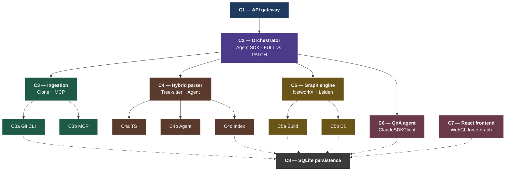

# Meridian

> A remote-first, agent-powered code knowledge graph builder.

Point Meridian at any GitHub repository and get back an interactive, queryable knowledge graph — no local install required. Built with the Claude Code Agent SDK, tree-sitter, NetworkX, and Leiden clustering.

## Features

- **Zero install for end users** — just provide a GitHub URL (and a PAT for private repos).
- **Two-pass parsing** — tree-sitter for deterministic AST extraction across 25 languages, agent reasoning for surgical resolution of ambiguous edges.
- **Differential updates** — incremental graph patches in seconds via a built-in diff engine; no full rebuilds.
- **Graph-grounded QnA** — answers cite specific nodes and files, not hallucinated references.
- **Interactive visualization** — WebGL-rendered force graph with semantic zoom, community coloring, and confidence-weighted edges.
- **Rate-limit-safe ingestion** — bulk file fetching uses `git clone` via subprocess (git protocol, zero API calls); GitHub MCP is used only for metadata enrichment.

---

## Architecture

Meridian is structured as **eight top-level components** (C1–C8) with sub-units lettered (e.g. C3a, C4b). C8 is shared persistence — every other component reads or writes through it.



_Solid arrows = synchronous calls. Dashed arrows = persistence reads/writes; every component touches C8._

### Layer 1 — Ingestion

| Component | Technology | Role |
| ----------- | ---------- | ------ |
| C1: API Gateway | FastAPI | REST endpoints, WebSocket build progress, serves React SPA |
| C3a: Git Client | git CLI (subprocess) | Initial clone + pull via git protocol — zero API rate limit impact. Writes ephemeral clones to `/var/meridian/cache/{repo_hash}/` |
| C3b: GitHub MCP | GitHub MCP Server | Metadata only: diffs, PRs, issues, contributors |

**Hybrid ingestion model (rate-limit protection):**

| Operation | Method | API calls |
| ----------- | -------- | ----------- |
| Initial build | `git clone` via subprocess | 0 |
| Incremental update | `git pull` via subprocess + MCP diff | 2–5 |
| Metadata enrichment | GitHub MCP (PRs, issues, contributors) | 5–20 |
| **Total per sync** | | **~10–25** (vs 500–2000+ with MCP-only) |

### Layer 2 — Processing

| Component | Technology | Role |
| ----------- | ---------- | ------ |
| C2: Orchestrator | Claude Code Agent SDK | Coordinates pipeline; makes build vs. update decisions |
| C4a: Tree-sitter (Pass 1) | py-tree-sitter | Deterministic AST extraction across 25 languages → `EXTRACTED` edges |
| C4b: Agent Reasoning (Pass 2) | Agent SDK tools | Resolves ambiguous edges with grep/glob/read → `INFERRED` edges |
| C4c: Tree Indexer | SQLAlchemy + SQLite | Persists the C4a+C4b parse tree to `trees`; mutated in place during PATCH |

**Pass 1** extracts modules, classes, functions, methods, and all deterministic edges (imports, calls, contains, inherits, decorates) from raw ASTs. Ambiguous references are flagged for Pass 2.

**Pass 2** fires only for flagged edges. It uses `glob` to find candidate files, `grep` to locate definitions, and `read` to load specific line ranges — loading 2–3 files per resolution rather than the full repo. Clean codebases: ~10–15% of edges need agent resolution. Metaprogramming-heavy codebases: ~30–40%.

### Layer 3 — Graph

| Component | Technology | Role |
| ----------- | ---------- | ------ |
| C5a: Graph Builder | NetworkX | Merges `EXTRACTED` + `INFERRED` edges into a unified graph |
| C5b: Leiden Clustering | graspologic | Community detection on graph topology; no embeddings |
| C8: Graph Store | SQLite (`meridian.db`) | Durable persistence for graphs and users |

**Node schema:**
```json
{
  "id": "src/auth/tokens.py::validate_token",
  "type": "function",
  "name": "validate_token",
  "file": "src/auth/tokens.py",
  "line_start": 42,
  "line_end": 67,
  "language": "python",
  "params": ["token: str"],
  "docstring": "Validates a JWT token and returns the user payload.",
  "community": 3
}
```

**Edge schema:**
```json
{
  "source": "src/routes/api.py::login",
  "target": "src/auth/tokens.py::validate_token",
  "type": "CALLS",
  "confidence": "EXTRACTED",
  "weight": 1.0,
  "metadata": {}
}
```

Edge types: `IMPORTS`, `CALLS`, `CONTAINS`, `INHERITS`, `DECORATES`, `RELATES_TO`, `DEPENDS_ON`  
Confidence levels: `EXTRACTED` (tree-sitter, high trust) · `INFERRED` (agent, medium trust)

### Layer 4 — Output

| Component | Technology | Role |
| ----------- | ---------- | ------ |
| C6: QnA Agent | ClaudeSDKClient | Answers questions grounded in a BFS-extracted subgraph (~2k tokens) |
| C7: React Frontend | React + react-force-graph (WebGL) | Interactive graph visualization with semantic zoom |

**QnA flow:** BFS from keyword-matched nodes → 2-hop subgraph (~2k tokens) → single ClaudeSDKClient completion → answer with node/file citations. No tool loop needed; the graph is the context.

**Frontend:** Force-directed WebGL layout (handles 5k+ nodes), Leiden community coloring, confidence-weighted edge thickness, semantic zoom (community super-nodes → god nodes → all labeled nodes), node sidebar with docstring + file link, QnA panel that highlights relevant subgraph nodes on answer.

---

## API Reference

All `/repos` endpoints require `Authorization: Bearer <token>`.

| Method | Path | Description |
| -------- | ------ | ------------- |
| `POST` | `/auth/register` | Create a user account |
| `POST` | `/auth/login` | Authenticate; returns JWT token |
| `POST` | `/repos` | Submit a repo for graph building |
| `GET` | `/repos` | List authenticated user's graphs |
| `GET` | `/repos/{graph_id}/graph` | Fetch the knowledge graph JSON |
| `POST` | `/repos/{graph_id}/query` | Ask a QnA question |
| `POST` | `/repos/{graph_id}/sync` | Trigger an incremental update |
| `DELETE` | `/repos/{graph_id}` | Permanently delete a graph |
| `WS` | `/repos/{graph_id}/status` | Stream build progress |

---

## Database Schema

```sql
CREATE TABLE users (
    user_id         TEXT PRIMARY KEY,
    email           TEXT UNIQUE NOT NULL,
    display_name    TEXT NOT NULL,
    github_username TEXT,
    hashed_password TEXT NOT NULL,
    role            TEXT DEFAULT 'member',
    created_at      TIMESTAMP DEFAULT CURRENT_TIMESTAMP,
    last_login_at   TIMESTAMP
);

CREATE TABLE graphs (
    graph_id        TEXT PRIMARY KEY,
    user_id         TEXT NOT NULL REFERENCES users(user_id),
    repo_url        TEXT NOT NULL,
    branch          TEXT DEFAULT 'main',
    last_commit_sha TEXT,
    graph_data      TEXT,
    status          TEXT DEFAULT 'building',
    node_count      INTEGER DEFAULT 0,
    edge_count      INTEGER DEFAULT 0,
    community_count INTEGER DEFAULT 0,
    error_message   TEXT,
    created_at      TIMESTAMP DEFAULT CURRENT_TIMESTAMP,
    updated_at      TIMESTAMP DEFAULT CURRENT_TIMESTAMP
);
```

---

## Storage Model

| Storage | Location | Lifecycle | Loss impact |
| --------- | ---------- | ----------- | ------------- |
| Repo cache (ephemeral) | `/var/meridian/cache/{repo_hash}/` | TTL 7 days idle; LRU on disk budget | Zero — re-clone on next sync |
| SQLite DB (durable) | `/var/meridian/db/meridian.db` | Persists until explicit DELETE | Catastrophic — back this up |

---

## Deployment

Single Docker image; SQLite embedded (no separate DB server).

```yaml
# docker-compose.yml
volumes:
  - ./meridian-data:/var/meridian
```

```
./meridian-data/
├── db/
│   └── meridian.db     ← durable: users + graphs (back this up)
└── cache/              ← ephemeral: git clones (evictable)
    ├── a1b2c3d4/
    └── e5f6g7h8/
```

**External network dependencies:**
- GitHub (git protocol) — clone + pull, not rate limited
- GitHub REST API via MCP — metadata enrichment only, 5–20 calls per sync
- Anthropic API — Agent SDK (orchestration + Pass 2) + ClaudeSDKClient (QnA)

---

## Cost Model

| Component | Cost |
| ----------- | ------ |
| git clone / pull | Free — git protocol |
| Tree-sitter Pass 1 | Free — local, deterministic |
| Diff engine | Free — local git operations |
| Graph builder + Leiden | Free — local CPU |
| SQLite persistence | Free — embedded |
| GitHub MCP metadata | ~10–25 API calls per sync (within 5,000/hr budget) |
| Agent SDK Pass 2 | Token cost — per ambiguous edge |
| Agent SDK orchestration | Token cost — pipeline coordination |
| ClaudeSDKClient QnA | Token cost — per user query |

**Optimization principle:** Tree-sitter handles ~80% of edges for free. Agent tokens burn only on the ~20% that genuinely need reasoning. On incremental syncs, only changed-file edges incur agent cost.

---

## Status

Early-stage. Proprietary — All Rights Reserved. See [LICENSE](LICENSE).

---

**Author:** Arka Patra
